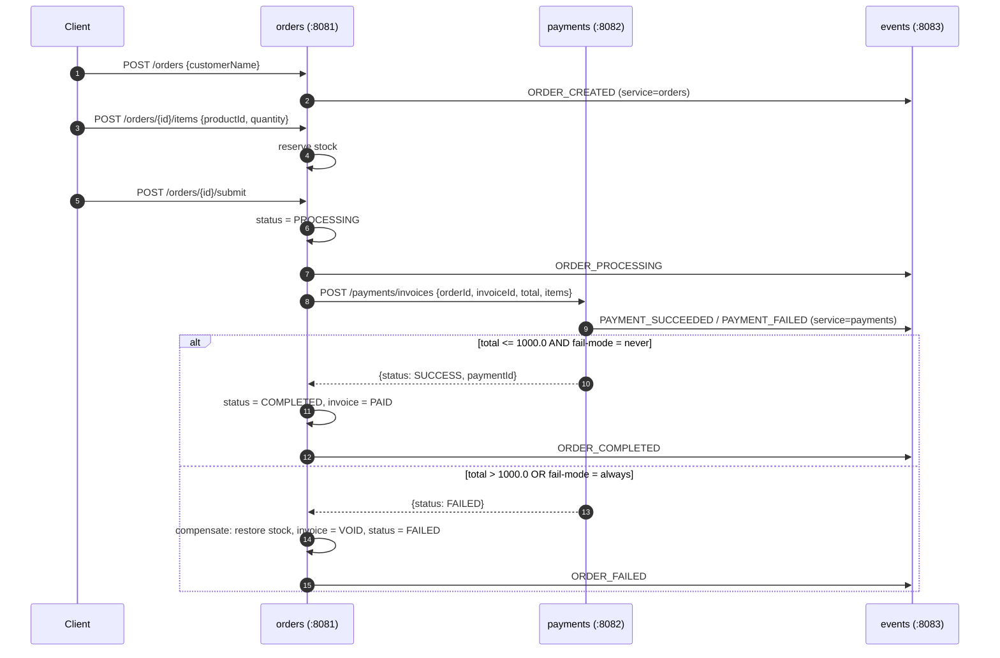

# Sagas Example — API Summary & Flow

Three microservices (Spring Boot 4.1, Java 25, JPA + SQLite) implementing an orchestrated saga:

| Service | Port | Role |
|---|---|---|
| `orders` | 8081 | Saga orchestrator (catalog + orders + compensation) |
| `payments` | 8082 | Fake payment gateway |
| `events` | 8083 | Append-only event log |

## Endpoints

### orders — `:8081`

| Method | Path | Body / Param | Result |
|---|---|---|---|
| GET | `/products` | — | catalog (Laptop 1200, Mouse 25, Keyboard 80, Monitor 300) |
| POST | `/orders` | `{"customerName": "Alice"}` | creates order `CREATED` |
| POST | `/orders/{id}/items` | `{"productId": 2, "quantity": 2}` | adds line + reserves stock |
| POST | `/orders/{id}/submit` | — | runs saga → `COMPLETED` or `FAILED` |
| GET | `/orders/{id}` | — | order + invoice (`PENDING`/`PAID`/`VOID`) |

### payments — `:8082`

| Method | Path | Body / Param | Result |
|---|---|---|---|
| POST | `/payments/invoices` | `{orderId, invoiceId, total, items[]}` | `SUCCESS` / `FAILED` |
| GET | `/payments?orderId=` | — | payment history |
| GET | `/payments/fail-mode` | — | current mode |
| POST | `/payments/fail-mode` | `{"mode": "always"\|"never"}` | toggles forced failure |

### events — `:8083`

| Method | Path | Body / Param | Result |
|---|---|---|---|
| POST | `/events` | `{orderId, service, type, payload}` | appends event |
| GET | `/events?orderId=` | — | event trail for an order |

**Payment rule**: fails if `total > 1000.0` (`app.payment.fail-threshold`) or `fail-mode=always`.

## Expected flow (orchestrated saga)



## Event trail (per order)

`ORDER_CREATED → ORDER_PROCESSING → PAYMENT_SUCCEEDED/FAILED → ORDER_COMPLETED/ORDER_FAILED`

- **Happy path** (2× Mouse, total 50): `ORDER_CREATED, ORDER_PROCESSING, PAYMENT_SUCCEEDED, ORDER_COMPLETED` — order `COMPLETED`, invoice `PAID`.
- **Compensation** (2× Laptop, total 2400): `ORDER_CREATED, ORDER_PROCESSING, PAYMENT_FAILED, ORDER_FAILED` — order `FAILED`, invoice `VOID`, stock restored.

## Quick start

```bash
docker compose up -d --build   # build + start all three
```

Swagger UI: `http://localhost:8081/swagger-ui.html` (also 8082, 8083).
