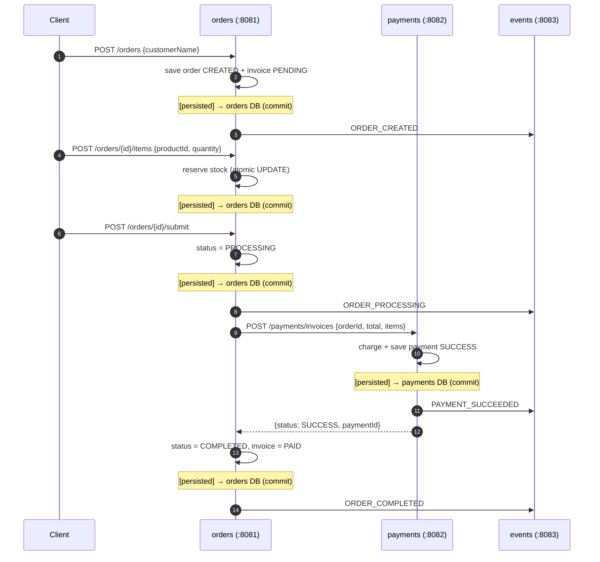
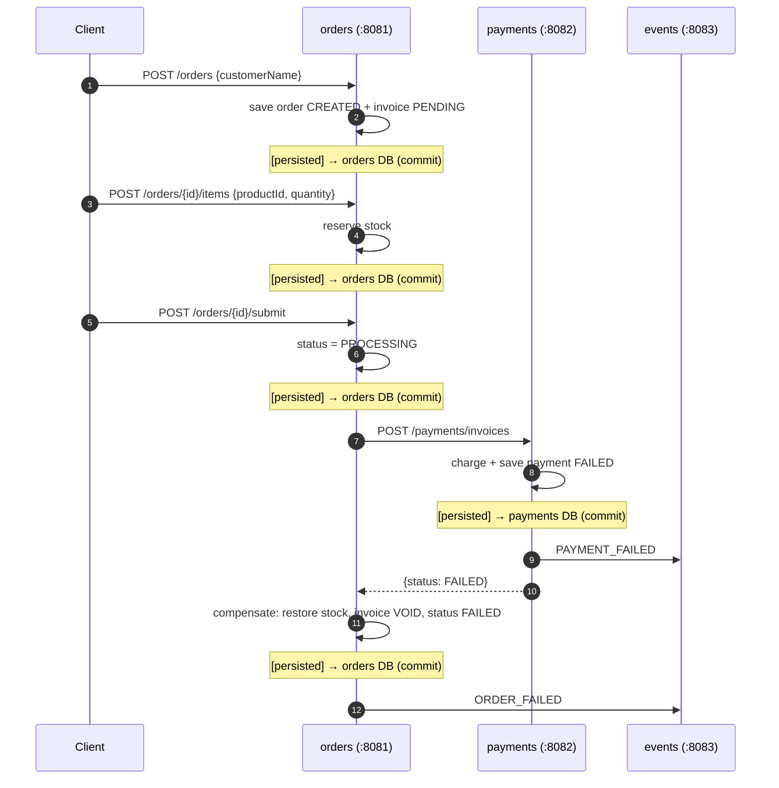
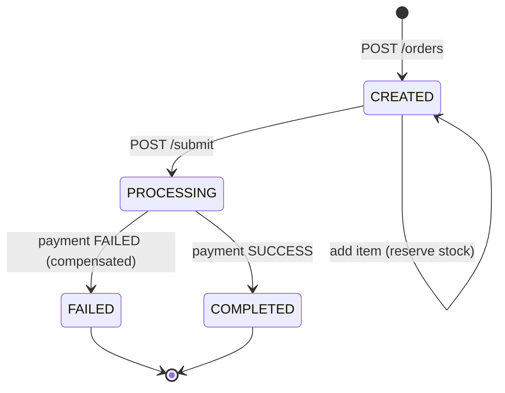

# Sagas Example

A minimal **orchestrated saga** demo with three Spring Boot services. One service
(`orders`) coordinates a multi-step business transaction across service boundaries,
and compensates (undoes) already-committed steps when a later step fails.

| Service | Port | Role | DB |
|---|---|---|---|
| `orders` | 8081 | Saga orchestrator: catalog + orders + compensation | orders DB |
| `payments` | 8082 | Fake payment gateway | payments DB |
| `events` | 8083 | Append-only event log | events DB |

Each service has its **own database**, and each saga step durably persists its
result before the saga moves on. `[persisted]` marks the moment data is written
to a database (commit). Anything not marked is in-memory / an HTTP call.

## Saga steps

```
1. create order            → order CREATED, invoice PENDING   [persisted → orders DB]
2. add items + reserve stock                                 [persisted → orders DB]
3. submit                  → order PROCESSING                 [persisted → orders DB]
4. charge payment          → payment record                   [persisted → payments DB]
5. COMPLETED (payment ok)     → order COMPLETED, invoice PAID [persisted → orders DB]
   COMPENSATE (payment failed) → restore stock, invoice VOID,
                                 order FAILED                 [persisted → orders DB]
```

## Happy path (payment succeeds)



## Compensation path (payment fails)



## Order state machine



Note: every transition above is persisted to the orders DB when it completes —
`[persisted] → orders DB` in the sequence diagrams.

## Payment failure rule

Payment fails when the invoice total is `> 1000.0` (`app.payment.fail-threshold`)
or `fail-mode` is `always` (toggled via `POST /payments/fail-mode`).

## Quick start

```bash
docker compose up -d --build   # build + start all three services
```

Swagger UI: `http://localhost:8081/swagger-ui.html` (also 8082, 8083).
