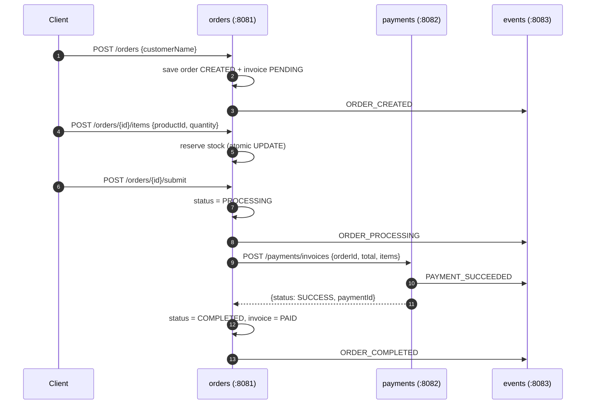
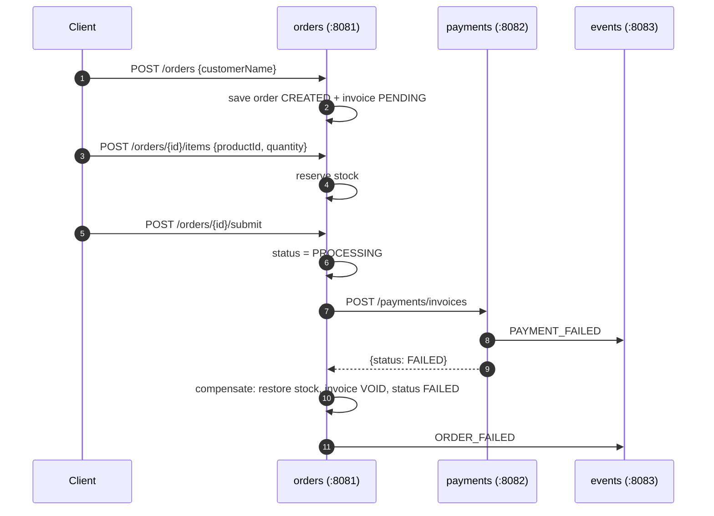
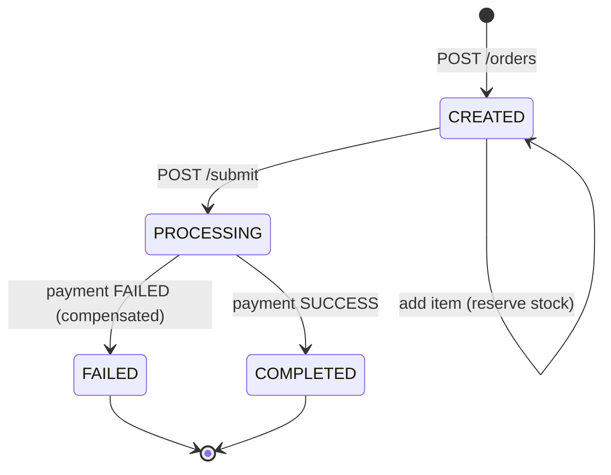

# Sagas Example

A minimal **orchestrated saga** demo with three Spring Boot services. One service
(`orders`) coordinates a multi-step business transaction across service boundaries,
and compensates (undoes) already-committed steps when a later step fails.

| Service | Port | Role |
|---|---|---|
| `orders` | 8081 | Saga orchestrator: catalog + orders + compensation |
| `payments` | 8082 | Fake payment gateway |
| `events` | 8083 | Append-only event log |

## Saga steps

```
1. create order            → order CREATED, invoice PENDING
2. add items / reserve stock
3. submit                  → order PROCESSING
4. charge payment          → payments service (own DB)
5. COMPLETED  (payment ok)     or
   COMPENSATE (payment failed) → restore stock, invoice VOID, order FAILED
```

## Happy path (payment succeeds)



## Compensation path (payment fails)



## Order state machine



## Payment failure rule

Payment fails when the invoice total is `> 1000.0` (`app.payment.fail-threshold`)
or `fail-mode` is `always` (toggled via `POST /payments/fail-mode`).

## Quick start

```bash
docker compose up -d --build   # build + start all three services
```

Swagger UI: `http://localhost:8081/swagger-ui.html` (also 8082, 8083).
